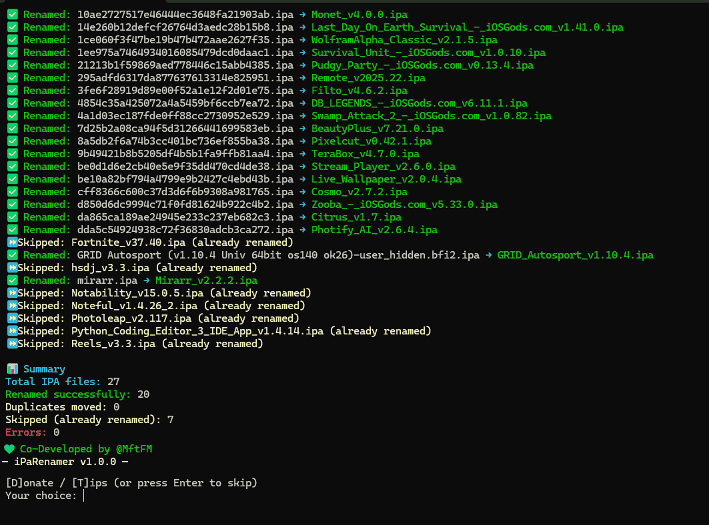

# 📜🖊️iPaRenamer

**✍🏻iPaRenamer** is a simple and powerful **automatic batch renaming tool** for iOS `.ipa` files.  
It reads all IPA files in a folder, extracts the **app name** and **version** from each app's `Info.plist`, and renames the files in a clean, consistent format:

```

AppName_v<version>.ipa


````

## 🖼 Screenshot



---

Duplicate IPAs are detected and moved to a `Duplicates/` folder to keep things organized.

---

## ✅ Features

- Fully automatic renaming of all `.ipa` files in a folder
- Extracts **App Name** and **Version** from each IPA
- Handles spaces, special characters, and invalid names
- Detects duplicates based on **file size + partial hash**
- Supports a `--dry-run` mode to preview changes without modifying files
- Cross-platform: **Windows, macOS, Linux**
- Easy to use — just place IPA files in a folder and run the script
- Donate/Tips link: [https://reymit.ir/mftfm](https://reymit.ir/mftfm)

---

## 🛠️ Requirements

- Python **3.10+** (tested on 3.10–3.13)
- Standard libraries included with Python: `os`, `zipfile`, `plistlib`, `hashlib`, `shutil`, `webbrowser`, `argparse`, `re`

**Installation**:  
Just make sure Python is installed and accessible from the terminal/command prompt.

**Check Python version**:
```bash
python --version
````

**Install Python**:

* **Windows / macOS / Linux**: [https://www.python.org/downloads/](https://www.python.org/downloads/)

---

## 🚀 How to Use

1. Place all `.ipa` files in a folder.
2. Open terminal/command prompt in that folder (or provide path using `-p`).
3. Run the CLI:

```bash
python ipa_renamer_final.py -p /path/to/ipas
```

4. Optional: dry-run to see changes without renaming:

```bash
python ipa_renamer_final.py -p /path/to/ipas --dry-run
```

The program will automatically rename all IPAs, append the version (`vX.Y.Z`), and create a `Duplicates/` folder if duplicates are found.

---

## 🌍 Platforms

* **Windows** (requires Python 3.10+)
* **macOS**
* **Linux**

---

## 💡 Usage Tip

* Just place your IPA files in a folder and run the script.
* No need to manually rename each file.
* Works even if filenames are messy or incomplete.

---

## 💚 Donate / Tips (Optional)

If you find this tool helpful and want to support development:
**Reymit:** [https://reymit.ir/mftfm](https://reymit.ir/mftfm)

---

## 📌 Summary

iPaRenamer makes managing large numbers of IPA files simple and organized.
Just **drop, run, done!**
